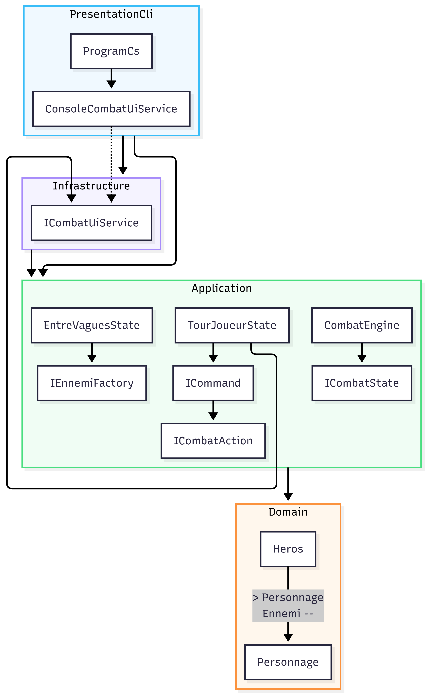

# Jeu de Combat Tour par Tour (CLI)

Projet réalisé dans le cadre du TP de Clean Code et Design Patterns (M2 - Sup de Vinci).

## 🚀 Fonctionnalités

- Jeu en console fluide au tour par tour.
- Saisie sécurisée des entrées utilisateur (gestion des erreurs de frappe).
- 3 classes de héros uniques :
  - **Guerrier** (120 PV, 18 ATQ, Compétence : _Frappe lourde_ avec temps de recharge).
  - **Mage** (80 PV, 12 ATQ, Compétence : _Éclair_ magique).
  - **Voleur** (90 PV, 14 ATQ, Compétence : _Coup critique_ avec 30% de chance d'infliger double dégâts).
- Système de gestion de vagues progressives :
  - **Vague 1** : 1 ennemi faible.
  - **Vague 2** : 2 ennemis simultanés.
  - **Vague 3** : Le Boss de fin (_Gromash le Destructeur_).
- Restauration partielle des PV du héros (+20%) lors des transitions entre deux vagues.

## 🏗️ Architecture & Découpage des Projets

Le projet applique rigoureusement les principes de la **Clean Architecture** à travers un découpage en 4 couches distinctes, garantissant l'indépendance de la logique métier vis-à-vis des détails technologiques (IHM Console) :

1. **CombatTourParTour.Domain** : Contient le cœur du métier (les entités pures `Personnage`, `Heros`, `Ennemi` et les énumérations). Aucun élément extérieur n'y est injecté.
2. **CombatTourParTour.Application** : Contient les règles d'exécution du combat, le orchestrateur de la machine à états (`CombatEngine`), les contrats d'interfaces et les classes de Design Patterns.
3. **CombatTourParTour.Infrastructure** : Implémente les détails techniques nécessaires à l'IHM. C'est ici que réside le service de rendu console (`ConsoleCombatUiService`) via l'inversion de dépendances.
4. **CombatTourParTour.Cli** : Point d'entrée de l'application (`Program.cs`). Il fait office de racine de composition (Composition Root) pour instancier les dépendances et démarrer le jeu.

